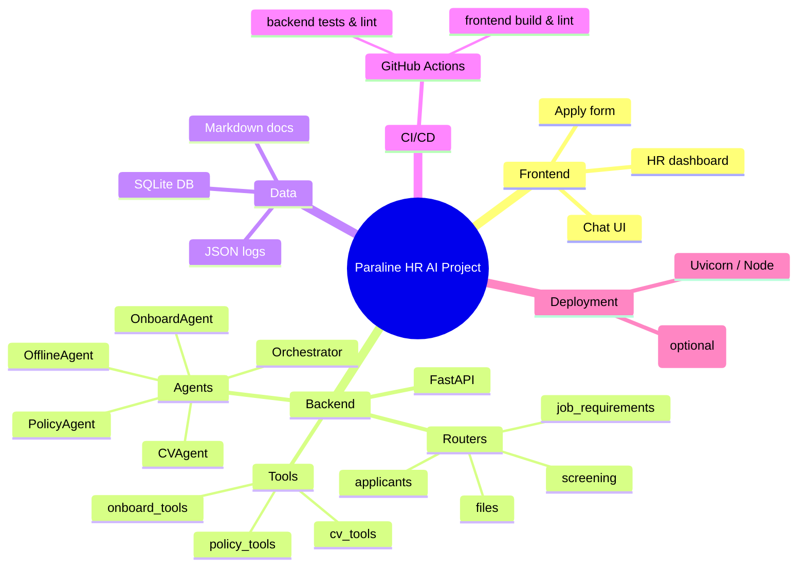
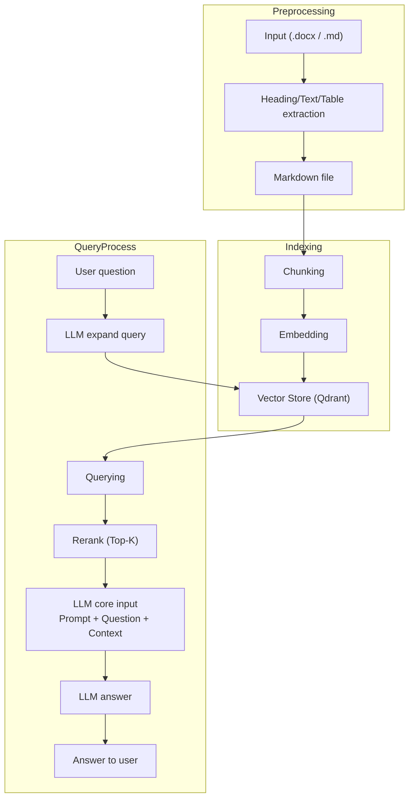

# Paraline HR AI Agent

This repository contains an end-to-end **HR assistant** built with a React/Next.js frontend and a Python/FastAPI backend. The system ships with several intelligent agents that answer HR policies, onboarding questions and perform CV screening using Google Generative AI (Gemini) or a simple offline knowledge base.

[](https://www.python.org/downloads/)
[](https://fastapi.tiangolo.com)
[](https://nextjs.org)
[](https://opensource.org/licenses/MIT)

---

## Overview

Paraline HR AI Assistant consists of two major layers:

1. **Backend** – FastAPI application with LangChain/LangGraph multi-agent workflow, SQLModel for database, and optional Gemini integration.
2. **Frontend** – Next.js app providing chat UI, job application form, and HR dashboard.

A lightweight Streamlit UI remains as legacy code but is no longer the primary focus.

---

## Features

- Multi-agent HR chatbot (policy, onboarding, CV screening) with intent orchestration.
- Automatic CV scoring when candidates apply.
- Offline mode using markdown Q&A files.
- Next.js frontend with chat widget and application workflow.
- Configurable via `.env`; supports offline/online toggle, custom model, rate limits, and analytics flags.

[](https://fastapi.tiangolo.com)
[](https://nextjs.org)
[](https://opensource.org/licenses/MIT)

---

## Installation

### Prerequisites
- Python 3.10+
- Node.js 18+
- pip / npm

### Backend setup

```bash
python -m venv .venv
source .venv/bin/activate    # or .venv\Scripts\activate on Windows
pip install -r requirements.txt
```

Create a `.env` file in the project root with keys such as:

```env
GOOGLE_API_KEY=          # optional when OFFLINE_MODE=true
MODEL_NAME=gemini-1.0
TEMPERATURE=0.7
OFFLINE_MODE=false
DATABASE_URL=sqlite:///data/sql_db/hr_agent.db
```

### Frontend setup

```bash
cd frontend
npm install
cat <<'EOF' > .env.local
NEXT_PUBLIC_API_BASE=http://localhost:8000
EOF
```

## Running

1. **Start the backend** (root directory):
   ```bash
   uvicorn api.main:app --reload --host 0.0.0.0 --port 8000
   ```
   The server will print a log like `[CONFIG] using Gemini model: ...` or
   `[CONFIG] offline mode – Gemini calls will be skipped` depending on your env.

2. **Start the frontend**:
   ```bash
   cd frontend
   npm run dev
   ```
   Open `http://localhost:3000` in a browser. Available pages:
   - `/chat` – chatbot interface
   - `/apply` – job application with CV upload
   - `/hr-dashboard` – HR dashboard for screening results

3. **Optional CLI screening**:
   ```bash
   python cv_screening.py
   ```
   Runs the batch screener and writes `screening_results.json`.

## Configuration details

- All configuration resides in `.env` and is loaded with `python-dotenv`.
- The `Config` object prints status on startup and validates keys unless
  `OFFLINE_MODE` is enabled.
- Add HR policy or onboarding docs under `documents/` and the offline agent
  will automatically load them.
- To add job positions, edit `job_requirements_config.json`.

## Offline mode

Set `OFFLINE_MODE=true` or leave `GOOGLE_API_KEY` blank to run without any
external API calls. The chat endpoint will answer using the local markdown
knowledge base; LLM clients are never initialized in this mode.

## Extending the project

- New tools can be added to `src/tools/` and registered with the appropriate
  agent.
- Agents are implemented in `src/agents/` and guard LLM initialization when
  offline or missing key.
- Frontend components live in `frontend/app/` following the Next.js App Router.

## Project pipeline diagrams

To make the processing flow even clearer, here are two visualizations of the
pipeline.  The first is a high‑level mind map; the second is a detailed
flowchart showing preprocessing, indexing, and generation steps.

### Mind map overview



### Detailed processing flow

This flowchart illustrates how documents move through the system: preprocessing
(conversion/heading extraction), chunking & embedding into the vector store,
query expansion, reranking, and final answer generation by the LLM.



## CI/CD Pipeline

This repository includes a simple continuous integration workflow that runs on
push and pull request events.  The pipeline is implemented with GitHub Actions
(`.github/workflows/ci.yml`) and performs the following steps:

## CI/CD Pipeline

This repository includes a simple continuous integration workflow that runs on
push and pull request events.  The pipeline is implemented with GitHub Actions
(`.github/workflows/ci.yml`) and performs the following steps:

1. **Checkout** the code.
2. **Backend job**
   - Set up Python 3.10.
   - Install dependencies from `requirements-dev.txt` (virtualenv created).
   - Run `pytest` to execute the unit and integration tests under `src/` and
     `tests/`.
   - Lint the Python code with `flake8`.
3. **Frontend job** (runs after backend job completes)
   - Set up Node 18.
   - Install packages in `frontend/` with `npm ci`.
   - Build the Next.js application (`npm run build`).
   - Run frontend linting (`npm run lint`).

Below is an example of the workflow file used in this project:

```yaml
name: CI

on: [push, pull_request]

jobs:
  backend:
    runs-on: ubuntu-latest
    steps:
      - uses: actions/checkout@v3
      - name: Set up Python
        uses: actions/setup-python@v4
        with:
          python-version: '3.10'
      - name: Install dependencies
        run: |
          python -m venv .venv
          source .venv/bin/activate
          pip install -r requirements-dev.txt
      - name: Run backend tests
        run: |
          source .venv/bin/activate
          pytest -q
      - name: Lint Python
        run: |
          source .venv/bin/activate
          flake8 src tests

  frontend:
    runs-on: ubuntu-latest
    needs: backend
    steps:
      - uses: actions/checkout@v3
      - name: Setup Node
        uses: actions/setup-node@v3
        with:
          node-version: '18'
      - run: |
          cd frontend
          npm ci
          npm run build
          npm run lint
```

You can extend the workflow to build Docker images, deploy to a server, or push
artifacts to a registry as needed.

## License

This project is licensed under the MIT License. Feel free to adapt or reuse it
for your own HR automation efforts.


---

## 🚀 Sử Dụng (Kiến Trúc Mới)

### 1. Chạy Backend FastAPI

Trong thư mục gốc:

```bash
uvicorn api.main:app --reload --port 8000
```

Kiểm tra:

```bash
curl http://localhost:8000/health
```

### 2. Chạy Frontend Next.js

Trong thư mục `frontend/`:

```bash
cd frontend
npm run dev
```

Truy cập:

- `http://localhost:3000` – Landing
- `http://localhost:3000/chat` – HR Chatbot (gọi `/chat`)
- `http://localhost:3000/apply` – Ứng tuyển + upload CV (gọi `/files/upload-cv` + `/applicants`)
- `http://localhost:3000/hr-dashboard` – Xem & chạy screening (gọi `/screening/*`)

### 3. CV Screening trực tiếp (CLI – tùy chọn)

```bash
python cv_screening.py
```

Sẽ đọc `job_requirements_config.json` và các CV trong DB/file để chấm điểm và export `screening_results.json`.

### 4. Legacy Streamlit UI (tuỳ chọn)

Nếu muốn xem UI cũ:

```bash
streamlit run streamlit_app.py           # Main app (chatbot + CV upload)
streamlit run hr_dashboard_page.py       # HR dashboard cũ
streamlit run job_requirements_manager.py  # Job config manager cũ
```

---

## ⚙️ Cấu Hình

### Job Requirements

**File:** `job_requirements_config.json`

**11 vị trí mặc định:**
1. Software Engineer
2. Frontend Developer
3. Backend Developer
4. QA Engineer
5. Project Manager
6. Business Analyst
7. HR Specialist
8. AI Engineer
9. AI Intern
10. DevOps Engineer
11. DevOps Intern

**Cấu trúc:**

```json
{
  "Software Engineer": {
    "technical_skills": {
      "required": {
        "programming": ["Python", "JavaScript"],
        "databases": ["SQL"]
      },
      "preferred": {
        "cloud": ["AWS", "Docker"]
      }
    },
    "experience": {
      "min_years": 2
    },
    "scoring": {
      "min_pass_score": 60
    }
  }
}
```

**Customize qua UI:**
```bash
streamlit run job_requirements_manager.py
```

---

## 📖 Hướng Dẫn Chi Tiết

### Cho Ứng Viên

**Nộp CV:**
1. Vào http://localhost:8501
2. Sidebar → **💼 Ứng Tuyển Việc Làm**
3. Điền form:
   - Họ tên
   - Email
   - Số điện thoại
   - Chọn vị trí
   - Upload CV (PDF/DOCX, max 10MB)
4. Click **📤 Nộp Hồ Sơ**

**Hỏi chatbot:**
- "Nghỉ phép mấy ngày?"
- "Giờ làm việc?"
- "Lương trả khi nào?"

---

### Cho HR Team

**Review CV:**

**Option A: Dashboard**
```bash
streamlit run hr_dashboard_page.py
```
- Xem summary stats
- Filter: Highly Recommended / Recommended / Consider / Reject
- View breakdown chi tiết
- Export Excel

**Option B: CLI**
```bash
python cv_screening.py
```
- Batch process tất cả CV
- Output terminal
- Export JSON

**Quản lý positions:**
```bash
streamlit run job_requirements_manager.py
```
- Tab 1: View requirements
- Tab 2: Add/Edit position
- Tab 3: Export config

---

## 🔧 Scoring Algorithm

**Total: 100 điểm**

| Category | Points | Calculation |
|----------|--------|-------------|
| Required Skills | 30 | (Matched/Total) × 30 |
| Preferred Skills | 20 | (Matched/Total) × 20 |
| Experience | 25 | Theo năm kinh nghiệm |
| Education | 15 | 15 nếu đúng ngành, 5 nếu không |
| Certifications | 10 | 5 điểm/cert, max 10 |

**Experience scoring:**
```
Years >= Required + 3: 25 pts
Years >= Required:     20 pts
Years >= Required - 1: 15 pts
Years < Required - 1:   5 pts
```

**Recommendations:**
```
Score >= Pass + 20: ⭐ STRONG_PASS (Highly Recommended)
Score >= Pass:      ✅ PASS (Recommended)
Score >= Pass - 10: ⚠️ MAYBE (Consider)
Score < Pass - 10:  ❌ REJECT (Not Recommended)
```

---

## 📁 Cấu Trúc Project

```
hr-ai-agent-pure-vector/
│
├── README.md                        ← Bạn đang đọc
├── requirements.txt                 ← Python backend deps
├── config/.env.example              ← Env template (vector DB, v.v.)
│
├── api/
│   ├── main.py                      ← FastAPI app (health, chat, routers)
│   └── routers/
│       ├── applicants.py            ← /applicants CRUD (SQLModel)
│       ├── screening.py             ← /screening (run + results)
│       ├── job_requirements.py      ← /job-requirements
│       └── files.py                 ← /files/upload-cv
│
├── src/
│   ├── agents/                      ← Orchestrator + policy/onboard agents (LangGraph)
│   ├── core/                        ← Config, gateway, admin (Gemini config)
│   ├── db_models.py                 ← SQLModel: Applicant, ScreeningResult, JobRequirement
│   ├── db.py                        ← create_engine, init_db, get_session
│   └── services/
│       └── vector_db.py             ← ChromaDB wrapper (HR policies)
│
├── frontend/                        ← Next.js + Tailwind frontend
│   ├── app/
│   │   ├── layout.tsx               ← Layout chung
│   │   ├── page.tsx                 ← Landing
│   │   ├── chat/page.tsx            ← HR chatbot UI
│   │   ├── apply/page.tsx           ← Form ứng tuyển + upload CV
│   │   └── hr-dashboard/page.tsx    ← HR dashboard (screening)
│   ├── lib/api.ts                   ← Client gọi FastAPI
│   └── lib/types.ts                 ← TypeScript types (Applicant, ScreeningResult,...)
│
├── cv_screening.py                  ← CV screening engine (dùng cho API & CLI)
├── job_requirements_config.json     ← Job requirements (screening)
├── docs/                            ← Knowledge base (HR policies)
├── chroma_db/                       ← Vector database storage
├── cv_uploads/                      ← Uploaded CV files
└── data/sql_db/hr_agent.db          ← SQLite DB (tự tạo)
```

---

## 🐛 Troubleshooting

### 1. "No applicants found"

**Nguyên nhân:** Database rỗng

**Giải pháp:**
```bash
# Nộp CV qua form hoặc
python create_sample_db.py
```

### 2. "Position not found"

**Nguyên nhân:** Vị trí trong DB không có trong config

**Giải pháp:**
```bash
streamlit run job_requirements_manager.py
# → Thêm vị trí mới
```

### 3. "Could not extract text from CV"

**Nguyên nhân:** PDF corrupt hoặc protected

**Giải pháp:**
- Re-save PDF
- Remove password
- Check file size < 10MB

### 4. "Module not found"

**Giải pháp:**
```bash
pip install -r requirements.txt
```

### 5. Chatbot không trả lời

**Nguyên nhân:** Chưa build knowledge base

**Giải pháp:**
```bash
# Rebuild vector database
python rebuild_knowledge_base.py
```

### 6. Lỗi chữ trắng trong chatbot

**Giải pháp:** Xem file `fix_white_text.txt`

---

## 📊 Performance

| Task | Time | Notes |
|------|------|-------|
| CV Upload | < 1s | Local storage |
| PDF Parsing | 1-3s | Depends on size |
| CV Scoring | < 1s | Per CV |
| Batch (10 CVs) | ~10s | Sequential |
| Chatbot Query | 0.5-1s | Vector search |

**Optimization:**
- Parallel processing cho batch screening
- Cache parsed CV text
- PostgreSQL cho production

---

## 🗺️ Roadmap

### Phase 1: Current ✅
- HR Chatbot
- CV screening (100 điểm)
- Dashboard
- Job manager

### Phase 2: Next Steps
- [ ] Email automation (SMTP)
- [ ] Calendar integration (Google Calendar)
- [ ] Advanced NLP parsing
- [ ] Multi-language support

### Phase 3: Future
- [ ] Interview management
- [ ] Analytics dashboard
- [ ] ATS integration
- [ ] Mobile app
- [ ] AI-powered matching

---

## 🔐 Security Notes

**Current (Development):**
- Local file storage
- No authentication
- JSON database
- Email logging only

**Production Recommendations:**
- Add authentication (Streamlit Auth)
- Encrypt sensitive data
- Use PostgreSQL
- Configure SMTP
- Cloud storage (S3/GCS)
- HTTPS
- Rate limiting

---

## 📝 Changelog

### v2.0.0 (2026-02-20)
- ✅ CV screening system
- ✅ HR dashboard
- ✅ Job requirements manager
- ✅ 11 positions
- ✅ Excel export

### v1.0.0 (2026-02-15)
- ✅ HR Chatbot
- ✅ CV upload
- ✅ ChromaDB integration

---

## 🤝 Contributing

```bash
# Fork & clone
git clone https://github.com/your-username/hr-ai-agent-pure-vector.git

# Create branch
git checkout -b feature/your-feature

# Make changes & test
pytest tests/

# Commit & push
git commit -m "Add: feature"
git push origin feature/your-feature

# Create PR
```

**Code Standards:**
- Python 3.9+
- PEP 8
- Type hints
- Docstrings

---

## 📄 License

MIT License - See [LICENSE](LICENSE) file

---

## 👥 Team & Contact

**Paraline Software**

- 🌐 Website: https://paraline.com.vn
- 📧 Email: info@paraline.com.vn
- 📞 Phone: +84 24-3200-4679
- 📍 Hanoi, Vietnam

**Support:**
- Email: hr@paraline.com.vn
- GitHub Issues: [Report Bug](https://github.com/your-org/hr-ai-agent-pure-vector/issues)

---

## 🙏 Acknowledgments

- **Streamlit** - Web framework
- **ChromaDB** - Vector database
- **PyPDF2** & **python-docx** - Document parsing
- **Claude AI** - Development assistance

---

## 📚 Documentation

- [Installation Guide](docs/installation.md)
- [User Manual](docs/user-manual.md)
- [API Reference](docs/api-reference.md)
- [LangChain Migration](LANGCHAIN_V1_MIGRATION_GUIDE.md)

---

## ⭐ Quick Start Summary (FastAPI + Next.js)

```bash
# 1. Backend
python -m venv .venv
.\.venv\Scripts\activate        # hoặc source .venv/bin/activate
pip install -r requirements.txt
uvicorn api.main:app --reload --port 8000

# 2. Frontend
cd frontend
npm install
echo "NEXT_PUBLIC_API_BASE=http://localhost:8000" > .env.local
npm run dev

# 3. Truy cập
# http://localhost:3000        (Landing)
# http://localhost:3000/chat   (HR Chatbot)
# http://localhost:3000/apply  (Ứng tuyển)
# http://localhost:3000/hr-dashboard (HR Dashboard)
```

---

**Made with ❤️ in Hanoi, Vietnam**

**© 2017-2026 Paraline Software • Japan Quality in Vietnam**

---

## 🎯 Key Features Summary

| Feature | Status | Description |
|---------|--------|-------------|
| HR Chatbot | ✅ | 440+ docs, Vietnamese support |
| CV Upload | ✅ | PDF/DOCX, auto-storage |
| CV Screening | ✅ | 100-point scoring |
| Dashboard | ✅ | Filter, export Excel |
| Job Manager | ✅ | 11 positions, customizable |
| Email Notify | 🔄 | Log only (SMTP coming) |
| Analytics | 📅 | Planned |
| Mobile | 📅 | Planned |

**Legend:** ✅ Done | 🔄 In Progress | 📅 Planned

---

**⭐ Star this repo if you find it useful!**

<<<<<<< HEAD
**🐛 Found a bug? [Report it](https://github.com/your-org/hr-ai-agent-pure-vector/issues)**
=======
**🐛 Found a bug? [Report it](https://github.com/your-org/hr-ai-agent/issues)**
>>>>>>> b7ada183f4e12dbd4a971bcaefe8875979929cfb
